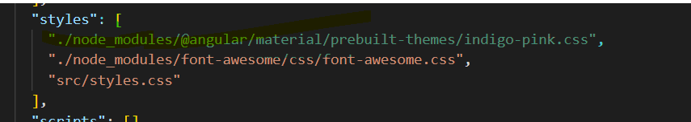
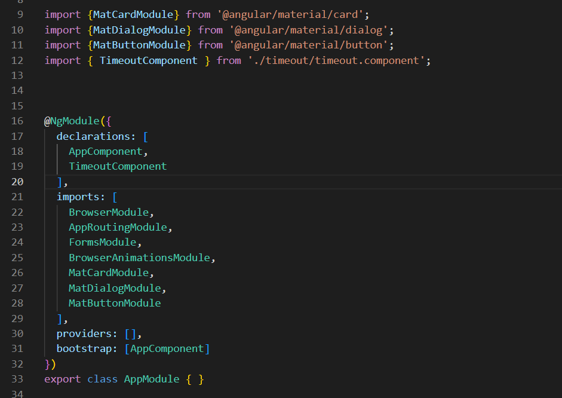
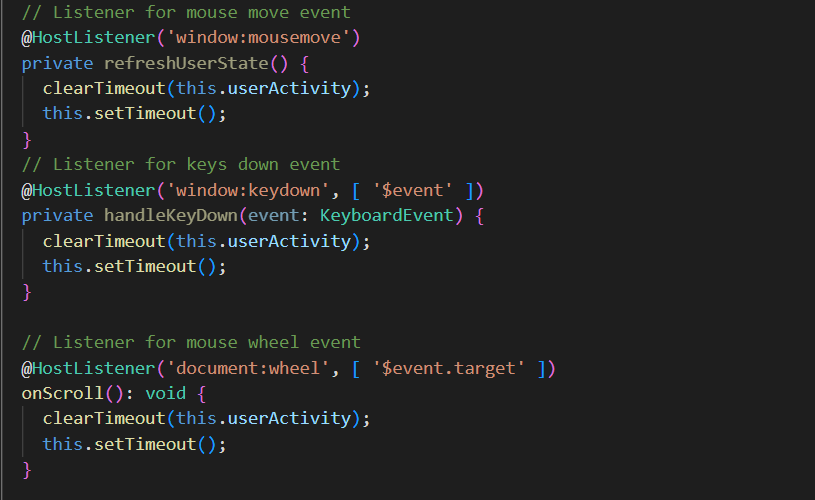

# analog-to-digital

## Steps

1. Create a new Angular Project using below command
    `ng new analog-to-digital`
2. Change the directory `cd analog-to-digital`
3. Add Angular Material to project using this command `ng add @angular/material`
4. Include styles in **angular.json** file, as shown below 
    
5. Add required modules in `app.module.ts` file, under **imports** array
    
6. Create a new component for showing a dialog `ng g c timeout`
7. Included all the code related to analog & digital time in **app.component. ts**
8. Below code snippet is for checking the events/actions (scroll/mouse/keys)
    
9. If the user is idle for 3mins, a dialog will appear. Where user can **Continue** or **Cancel**. **Cancel** will redirects to [Google page](https://www.google.com)

## Steps for application installation

1. Clone the project using below command in terminal

    `git clone https://github.com/NagarjunaReddyNaran/analog-to-digital.git`

2. Change the directory (Use 'cd')
3. Run `npm install` to install all the dependencies in `package.json` file
4. Run `ng serve` for a dev server. Navigate to `http://localhost:4200/`. The app will automatically reload if you change any of the source files.

